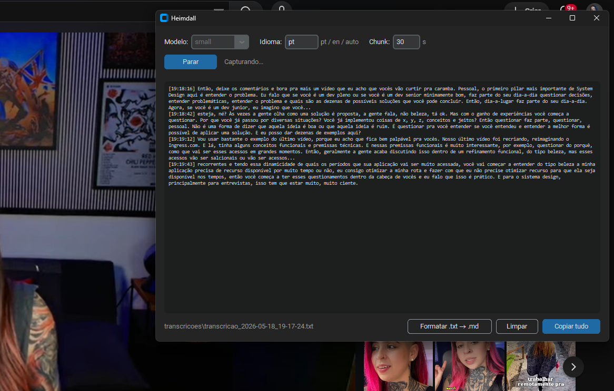
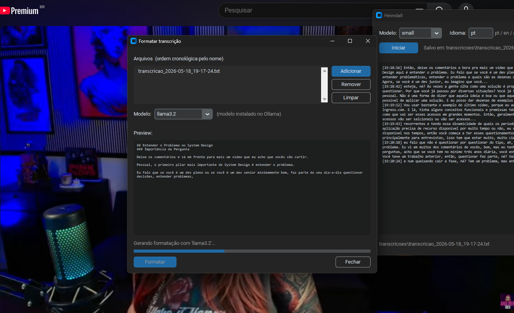
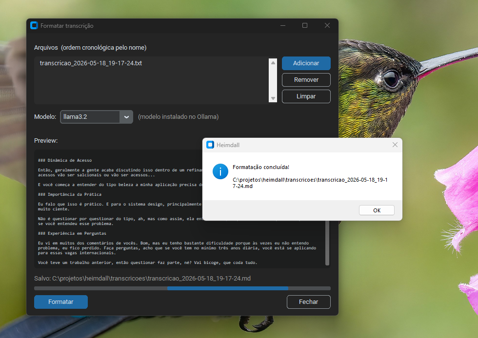

# Heimdall

<p align="center">
  
</p>

> *In Norse mythology, Heimdall is the guardian of the Bifrost bridge — the one that connects the worlds. Gifted with superhuman senses, he can see hundreds of miles in every direction and hear sounds as subtle as grass growing and wool forming on sheep. Nothing that happens across the nine worlds escapes his perception.*

The name is a deliberate choice: just like the Norse guardian, this program listens to everything that passes through your computer and turns it into a permanent record. Classes, lectures, videos, meetings — any sound coming out of your speakers becomes text, organized and saved automatically.

---

## What it is

Heimdall is a desktop tool for **real-time system audio transcription**. It captures the sound being played on your computer — no microphone needed, no manual recording, no reliance on subtitles — and converts it to text using artificial intelligence that runs entirely on your machine, without sending any data to the internet.

Beyond transcription, Heimdall includes an **intelligent formatter**: after capturing content, you can process the raw transcriptions with a local LLM that organizes the text into structured Markdown, with titles, subtitles, and bullet points, preserving every word of the original.

---

## Screenshots

**Transcribing a video in real time**

<p align="center">
  
</p>

**Formatting the transcription into Markdown**

<p align="center">
  
</p>

**Formatting complete**

<p align="center">
  
</p>

---

## What it's for

- **Study more efficiently** — watch classes and videos knowing the content will be saved as searchable text
- **Review content** — re-read important passages without rewinding the video
- **Create automatic notes** — the transcription becomes an organized `.md` file by topic with one click
- **Accessibility** — follow any audio content in text format
- **Meetings and conferences** — log what was said without manual effort

---

## Who can benefit

- Students watching recorded or live lectures
- Researchers who consume video content and need notes
- Professionals who attend many online meetings
- People who prefer text over audio for review and study
- Anyone who wants to turn spoken content into written, organized material

---

## How it works

The program intercepts system audio via **WASAPI loopback** (a native Windows technology that captures sound before it reaches the speaker, with no virtual audio cable needed). Audio is recorded in configurable chunks and transcribed by **Whisper**, OpenAI's speech recognition model that runs locally.

```
System audio
      |
      v
 WASAPI Loopback          <- pyaudiowpatch
      |
      v
  Record WAV (chunk)
      |
      v
   Local Whisper          <- faster-whisper
      |
      v
  Text with timestamp
      |
      v
  .txt file  +  Screen
      |
      v (optional)
   Local LLM              <- ollama
      |
      v
  Organized .md document
```

Capture and transcription run in parallel on separate threads: while one chunk is being transcribed, the next is already being recorded, without interruption.

---

## Technologies

| Library | Purpose |
|---|---|
| [pyaudiowpatch](https://github.com/s0d3s/PyAudioWPatch) | System audio capture via WASAPI loopback on Windows |
| [faster-whisper](https://github.com/SYSTRAN/faster-whisper) | Speech-to-text transcription, runs locally (4-8x faster than original Whisper via CTranslate2) |
| [ffmpeg](https://ffmpeg.org) | Whisper dependency for audio processing |
| [ollama](https://github.com/ollama/ollama-python) | Python client to run LLMs locally — used to format transcriptions into Markdown |
| [customtkinter](https://github.com/TomSchimansky/CustomTkinter) | Modern GUI with dark mode |

### Whisper models

| Model | Speed (CPU) | Quality | VRAM (GPU) |
|---|---|---|---|
| tiny | very fast | low | ~1 GB |
| base | fast | good | ~1 GB |
| small | medium | very good | ~2 GB |
| medium | good on CPU* | excellent | ~5 GB |
| large | medium/slow | maximum | ~10 GB |

> *With `faster-whisper`, the `medium` model runs well on CPU thanks to `int8` quantization. It offers the best quality/speed balance for everyday use.
>
> If you have an NVIDIA GPU, the program detects it automatically and uses `float16` for even faster processing.

---

## Requirements

- Windows 10 or 11
- Python 3.9+
- ffmpeg installed and on PATH
- [Ollama](https://ollama.com) installed (only needed for the formatter)

### Install ffmpeg

```bash
winget install ffmpeg
```

Or download manually from [ffmpeg.org](https://ffmpeg.org/download.html) and add the `bin` folder to your system PATH.

---

## Installation

```bash
# Clone or download the project
cd heimdall

# Install dependencies
pip install -r requirements.txt
```

> On first install, PyTorch and CTranslate2 (faster-whisper dependencies) will be downloaded automatically — this may take a few minutes.

### Install Ollama (for the formatter)

The formatter runs a LLM locally via [Ollama](https://ollama.com). No account or API key needed.

1. Download and install Ollama at ollama.com
2. Pull a model:

```bash
# Lightweight and fast (~2 GB)
ollama pull llama3.2

# Better quality in Portuguese (~5 GB)
ollama pull qwen2.5
```

3. Ollama starts automatically with Windows after installation. If needed, run it manually:

```bash
ollama serve
```

---

## Usage

### Graphical interface

```bash
python gui.py
```

1. Select the Whisper model, language, and chunk duration
2. Click **Start**
3. Text appears on screen as audio is transcribed, with a timestamp for each chunk
4. If the orange warning **"queue: N pending chunk(s)"** appears, transcription is falling behind — increase the chunk value
5. Click **Stop** when done
6. The `.txt` file is saved automatically in `transcricoes/`

#### Format a transcription

After capturing, click **Format .txt → .md** in the footer:

1. Click **Add** and select one or more `.txt` files from `transcricoes/`
2. When multiple files are selected, they are merged in chronological order by filename
3. Choose the installed Ollama model (e.g. `llama3.2`, `qwen2.5`)
4. Click **Format** — the generated text appears in real time in the preview
5. The `.md` file is saved in the same directory, with organized titles, subtitles, and bullet points

### Command line

```bash
# Basic usage
python main.py

# With options
python main.py --model small --lang pt --chunk 20
```

| Argument | Description | Default |
|---|---|---|
| `--model` | Whisper model: tiny, base, small, medium, large | `base` |
| `--lang` | Audio language (pt, en, es...). Omit for auto-detection | auto |
| `--chunk` | Duration in seconds of each captured chunk | `30` |

Press `Ctrl+C` to stop. The transcription is saved to `transcricoes/transcricao_<date_time>.txt`.

---

## Project structure

```
heimdall/
├── gui.py              # Graphical interface (customtkinter)
├── main.py             # Command-line interface
├── audio_capture.py    # Audio capture via WASAPI loopback
├── transcriber.py      # faster-whisper wrapper
├── formatter.py        # .txt to .md formatting via local LLM
├── requirements.txt    # Dependencies
└── transcricoes/       # Output files (created automatically)
```

---

## Notes

- The program captures **all system audio**, including notifications and OS sounds. It is recommended to close unwanted audio sources before starting.
- Smaller chunks reduce the waiting time before text appears on screen, but if transcription cannot keep up with the capture rate, the queue indicator will appear in orange — in that case, increase the chunk value.
- The Whisper model is loaded once at startup — there is no delay between chunks after the first one.
- `faster-whisper` automatically detects if an NVIDIA GPU is available. On CPU it uses `int8` quantization; on GPU it uses `float16`.
- The formatter does not alter the content of the text — it only reorganizes and structures what was already said.
